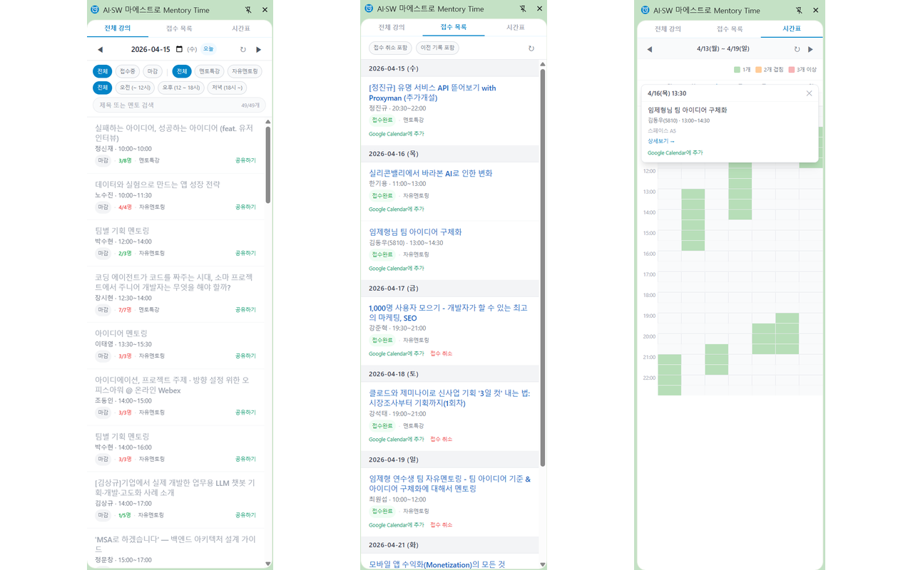

# MentoryTime

[AI·SW마에스트로](https://www.swmaestro.ai) 멘토링/특강 일정을 사이드패널에서 한눈에 관리하는 크롬 확장프로그램입니다.



## 주요 기능

### 전체 강의


- 날짜별 전체 멘토링/특강 목록 조회
- 상태(접수중/마감), 카테고리(멘토특강/자유멘토링), 시간대별 필터링
- 제목 및 멘토 이름 검색
- 내가 접수완료한 강의 초록색 하이라이트
- 날짜별 24시간 독립 캐시 (새로고침 전까지 유지)

### 접수 목록


- 내 접수내역을 강의날짜/시간 기준 정렬
- 접수완료/접수취소 필터 토글, 과거 기록 포함 토글
- 사이드패널에서 직접 접수 취소
- Google Calendar 일정 추가
- 사이드패널 내 로그인 지원

### 주간 시간표


- 30분 단위 슬롯, 겹침 수에 따라 색상 구분 (초록/주황/빨강)
- 슬롯 클릭 시 해당 시간대 강좌 목록 팝오버 (장소 정보 포함)
- 특강 상세 페이지 방문 시 시간표에 가상 반영하여 겹침 확인 (시뮬레이션)

## 설치 방법

### Chrome Web Store (권장)

[Chrome Web Store에서 설치](https://chromewebstore.google.com/detail/lomigmnchnpcchbilnnnedcjacigcdcj)

### 수동 설치

1. [Releases](https://github.com/kisusu115/mentory-time/releases)에서 최신 zip 파일 다운로드
2. 압축 해제
3. Chrome에서 `chrome://extensions` 접속
4. 우측 상단 **개발자 모드** 활성화
5. **압축해제된 확장 프로그램을 로드합니다** 클릭 후 압축 해제한 폴더 선택

## 기술 스택

Manifest V3 · React 18 · Vite · CRXJS · TypeScript · Tailwind CSS · Zustand

## 개발

```bash
pnpm install          # 의존성 설치
pnpm dev              # 개발 서버 (HMR)
pnpm build            # 타입체크 + 프로덕션 빌드
pnpm lint             # ESLint (--max-warnings 0)
```

## 배포 자동화

- `main` 브랜치에 머지되면 GitHub Actions가 자동 실행됩니다.
- patch 버전 자동 증가 → 빌드 → Chrome Web Store 드래프트 업로드 → GitHub Release 생성

---

## 개인정보처리방침

MentoryTime은 사용자의 개인정보를 수집하거나 외부 서버로 전송하지 않습니다.

### 데이터 처리 방식

- swmaestro.ai에 로그인된 상태에서 접수내역/강의 목록 데이터를 가져옵니다.
- 모든 데이터는 브라우저 로컬 저장소(`chrome.storage.local`)에만 저장되며, 외부 서버나 제3자에게 전송되지 않습니다.
- 로그인 정보 저장 시 AES-256-GCM 암호화를 적용합니다.
- 확장프로그램을 제거하면 저장된 모든 데이터가 함께 삭제됩니다.

### 접근 권한

| 권한                     | 사용 목적                                        |
| ------------------------ | ------------------------------------------------ |
| `sidePanel`              | 사이드 패널 UI 표시                              |
| `storage`                | 접수내역/강의 목록/설정 로컬 캐싱                |
| `scripting`              | swmaestro.ai 탭에서 인증된 세션으로 데이터 fetch |
| `https://swmaestro.ai/*` | 접수내역/강의 목록 데이터 fetch                  |

### 문의

문의사항은 [GitHub Issues](https://github.com/kisusu115/mentory-time/issues)를 통해 남겨주세요.
